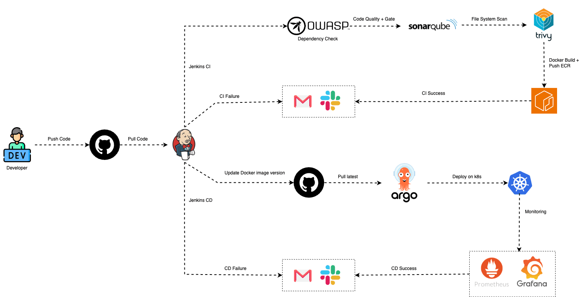
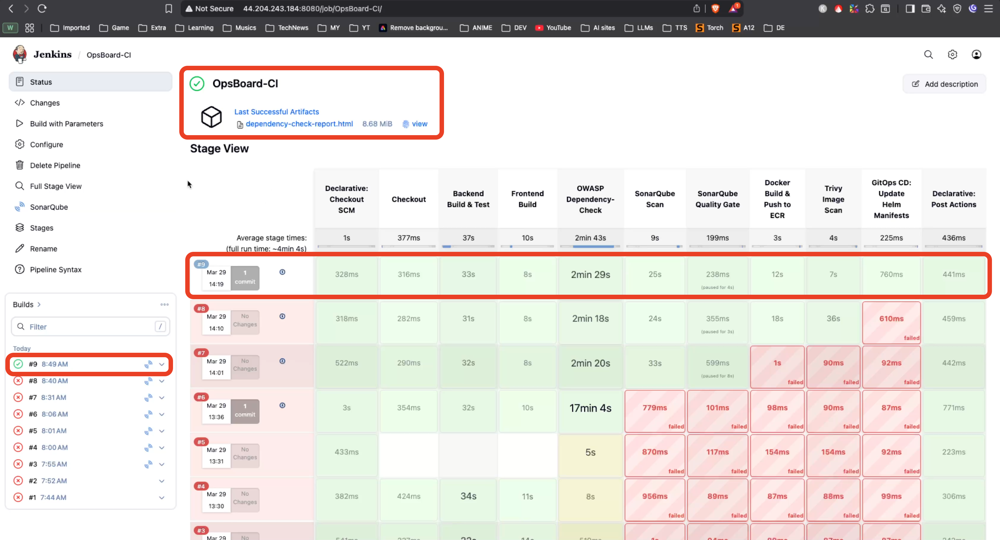
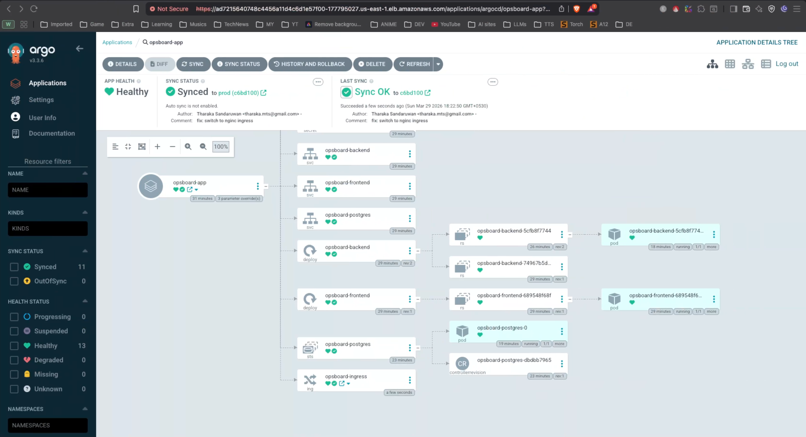
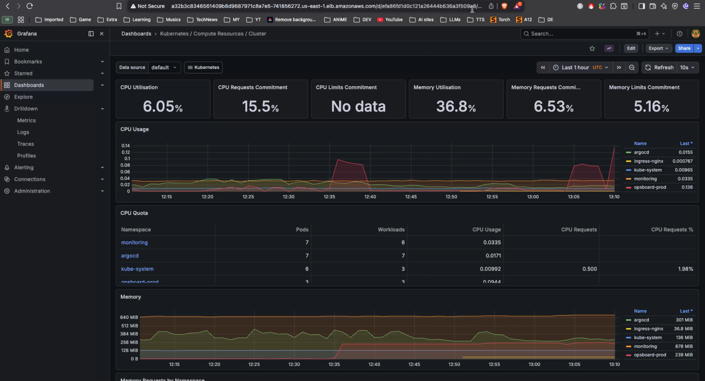
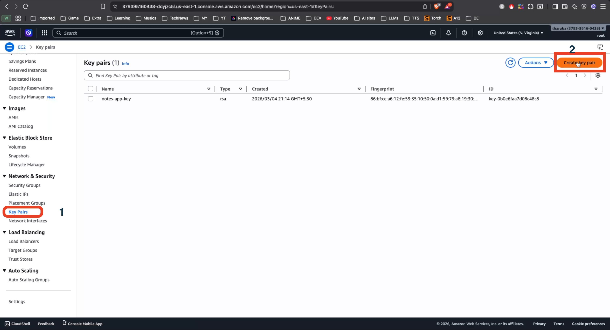
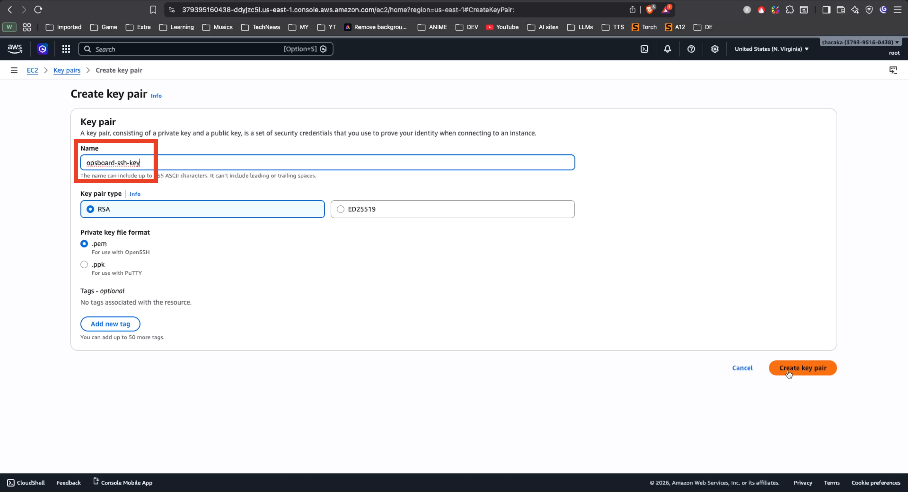
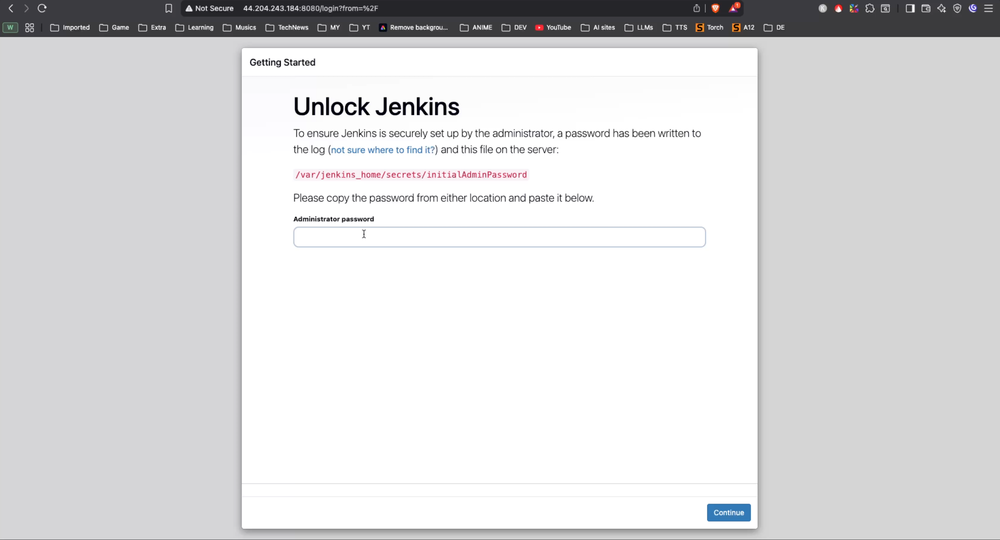
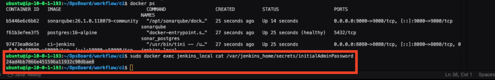
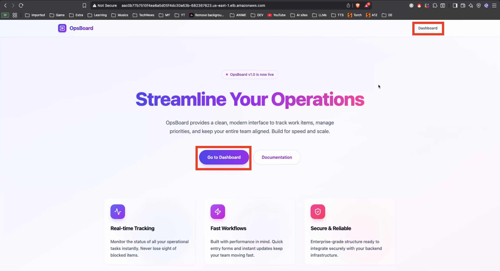
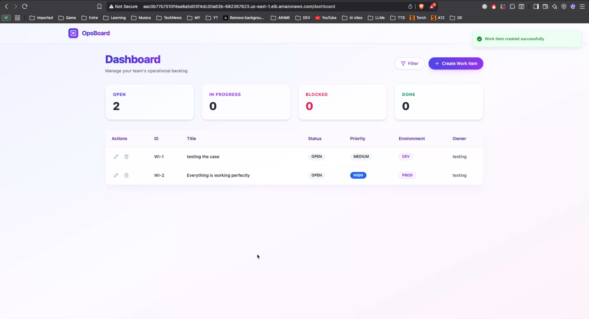

# 🚀 OpsBoard: End-to-End DevSecOps Platform on AWS EKS



OpsBoard is a professional-grade, production-ready DevSecOps project demonstrating a full CI/CD lifecycle for a Spring Boot and React application deployed on Amazon EKS (Elastic Kubernetes Service).

---

## 🏗️ Tech Stack Teaser

- **GitHub (Code)**: Version Control and Repository Management.
- **Docker (Containerization)**: Consistent application environments.
- **Jenkins (CI)**: Centralized orchestration for the CI pipeline.
- **OWASP (Dependency Check)**: Software Composition Analysis (SCA) for vulnerability scanning.
- **SonarQube (Quality)**: Static Application Security Testing (SAST).
- **Trivy (Filesystem Scan)**: Deep container image and filesystem scanning.
- **ArgoCD (CD)**: GitOps-based Continuous Deployment to Kubernetes.
- **Redis (Caching)**: Integrated within ArgoCD for efficient state management.
- **AWS EKS (Kubernetes)**: Managed Kubernetes service for production workloads.
- **Helm (Monitoring & Management)**: Packaging and monitoring using Prometheus and Grafana.

---

## Quick Overview CI/CD after deployment

- **Jenkins Pipeline - Build, Test, Scan, Push & Update values.yaml**


- **ArgoCD - Deploy to EKS**


- **Monitoring - Prometheus & Grafana**


---

## 🗺️ Quick Navigation

- [📋 Phase 1: Prerequisites & Keys](#-phase-1-prerequisites--keys)
- [🛠️ Phase 2: Infrastructure Provisioning (Terraform)](#-phase-2-infrastructure-provisioning-terraform)
- [🔄 Phase 3: Jenkins Controller Setup (CI Part 1)](#-phase-3-jenkins-controller-setup-ci-part-1)
- [🧪 Phase 4: Jenkins Agent & CI Flow (CI Part 2)](#-phase-4-jenkins-agent--ci-flow-ci-part-2)
- [🚢 Phase 5: EKS & CD Setup (ArgoCD Part 1)](#-phase-5-eks--cd-setup-argocd-part-1)
- [📊 Phase 6: Monitoring & Final Sync (CD Part 2)](#-phase-6-monitoring--final-sync-cd-part-2)
- [✅ Deployment Verification](#-deployment-verification)

---

## 📋 Phase 1: Prerequisites & Keys

Before starting, prepare all the necessary tokens and keys that will be used across the project:

### 1.1 IAM Tokens & Keys
| Key Name | Purpose |
| :--- | :--- |
| `opsboard-ssh-key` | AWS EC2 Key Pair for SSH access (.pem). |
| `github-credentials` | GitHub Personal Access Token (PAT) for repo access. |
| `slack-token` | Used for receiving real-time build and deployment alerts. |
| `nvd-api-key` | Used for OWASP Dependency-Check to fetch vulnerability data. |
| `sonar-token` | Used to authenticate Jenkins with SonarQube. |

### 1.2 Generate SSH Key
1. Go to **AWS Console -> EC2 -> Key Pairs**.

2. Create a RSA Key Pair named **`opsboard-ssh-key.pem`**.

3. Move the downloaded file to your local `terraform/` directory.

---

## 🛠️ Phase 2: Infrastructure Provisioning (Terraform)

### 2.1 Initial Provisioning (Without EKS)
To save time and costs during the CI setup, we first provision only the CI environment.
1. Copy terraform.tfvars.example to **`terraform/terraform.tfvars`** and ensure `create_eks = false`.
2. Run the following:

```bash
cd terraform
terraform init
terraform plan
terraform apply -auto-approve
```


### 2.2 Get Public IP
Open the deploy.instruction.md file or text file as you wish.
Copy the terraform output to the file ( For future reference ).
Note the **Jenkins Controller Public IP** from the Terraform output or the AWS Console.

---

## 🔄 Phase 3: Jenkins Controller Setup (CI Part 1)

### 3.1 Bootstrap CI Environment
Connect to your Jenkins Controller via SSH and start the environment.

```bash
# Log in to Jenkins Controller
ssh -i "opsboard-ssh-key.pem" ubuntu@<YOUR_JENKINS_CONTROLLER_IP>

# Clone the repository
git clone https://github.com/tharaka-mts/OpsBoard.git
cd OpsBoard/workflow/ci

# Start Jenkins and SonarQube using Docker Compose
docker-compose up -d
```

### 3.2 Jenkins Initialization
1. Open the Jenkins UI using the **Jenkins Controller Public IP**.
    ```bash
    http://<JENKINS_CONTROLLER_PUBLIC_IP>:8080
    ```
    

2. **To Get Admin Password Run Below Command in Jenkins Controller**:  
    ```bash
    docker exec -it jenkins cat /var/jenkins_home/secrets/initialAdminPassword
    ```
    
3.  **Generate SonarQube Token**:
    Log in to SonarQube (default admin:admin), go to **Security -> Tokens**, and generate a new token.
    ```bash
    http://<JENKINS_CONTROLLER_PUBLIC_IP>:9000
    ```    
    
3.  **Credential Setup**: Add the following credentials to Jenkins (**Dashboard -> Manage Jenkins -> Credentials**):
    - `slack-token` 
    - `github-credentials` 
    - `sonar-token` 
    - `nvd-api-key` 
    - `opsboard-ssh-key` 

### 3.3 Plugin Configuration
Install the **SonarQube Scanner** and **Quality Gate** plugins from **Manage Jenkins -> Plugins**.

---

## 🧪 Phase 4: Jenkins Agent & CI Flow (CI Part 2)

### 4.1 Connect Jenkins Agent
Add the **Jenkins Agent EC2** (created by Terraform) to the node inventory:
1. Go to **Manage Jenkins -> Nodes**.
2. Use the **Private IP** of the Agent EC2 and connect via SSH using the `opsboard-ssh-key`.

### 4.2 Verify Agent Environment
Log in to the Agent EC2 to ensure all dependencies are pre-installed by the Terraform bootstrap script:
```bash
docker --version
node --version
yarn --version
java --version
sonar-scanner --version
```

### 4.3 Configure SonarQube Webhook
Create a webhook in SonarQube pointing to: `http://<JENKINS_IP>:8080/sonarqube-webhook/`.

### 4.4 Run CI Pipeline
Create a Jenkins **Multibranch Pipeline** or **Pipeline Project**, point to your repo, and run the build.
*Note: The first run takes several minutes to download the OWASP vulnerability database.*


---

## 🚢 Phase 5: EKS & CD Setup (ArgoCD Part 1)

### 5.1 Final Infrastructure Apply
Now, enable the EKS cluster in Terraform.
1. Open **`terraform/terraform.tfvars`** and set `create_eks = true`.
2. Apply the changes:
```bash
cd terraform
terraform apply -auto-approve
```
*(Takes 10-30 minutes for EKS provisioning)*

### 5.2 Grant EKS Permissions
Ensure the **Jenkins Agent EC2 IAM Role** has the required permissions to manage the EKS cluster. Connect to the Agent EC2 and update its Kubeconfig:
```bash
aws eks update-kubeconfig --region us-east-1 --name opsboard-cluster
```

### 5.3 Deploy ArgoCD
```bash
# Create namespace
kubectl create namespace argocd

# Install ArgoCD
kubectl apply -n argocd -f https://raw.githubusercontent.com/argoproj/argo-cd/stable/manifests/install.yaml
```

---

## 📊 Phase 6: Monitoring & Final Sync (CD Part 2)

### 6.1 Expose ArgoCD & Login
Get the ArgoCD Admin password:
```bash
kubectl -n argocd get secret argocd-initial-admin-secret -o jsonpath="{.data.password}" | base64 -d
```
Access the ArgoCD UI using the **ALB URL** created by the Ingress.

### 6.2 Setup ArgoCD Application
1.  **Add Repo**: Connect your GitHub repo in ArgoCD Settings.
2.  **Create App**: Point to the **`helm/`** directory. Configure Parameters for:
    - `db_password`
    - `slack_token`
    - `postgres.image.repository` (EKS manual build repo)

### 6.3 Deploy Monitoring Stack
Since the main application Helm chart focuses on the app, deploy the monitoring stack separately:
```bash
cd monitoring
# Install Prometheus & Grafana using the provided values
helm install monitoring prometheus-community/kube-prometheus-stack -f prometheus-values.yaml
```

---

## ✅ Deployment Verification

- **Notifications**: Look out for Success messages in your Slack channel.
- **Application URL**: Access your app via the ALB Ingress URL.
- **Database Status**: If issues persist in the DB, login and run the `init-db.sql` manual steps provided in the documentation.





---

*OpsBoard Deployment Documentation - 2026*
